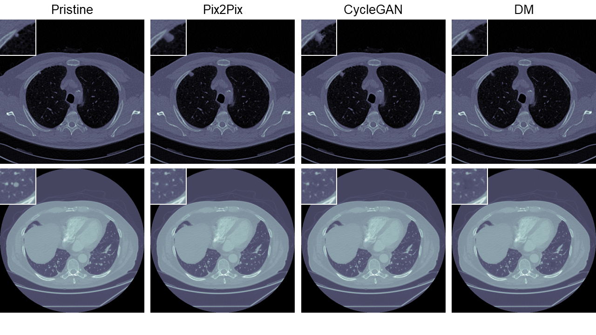

# M3Dsynth: A dataset of medical 3D images with AI-generated local manipulations 

## Overview

The ability to detect manipulated visual content is becoming increasingly important in many application fields, given the rapid advances in image synthesis methods. 
Of particular concern is the possibility of modifying the content of medical images, altering the resulting diagnoses. Despite its relevance, this issue has received limited attention from the research community. One reason is the lack of large and curated datasets to use for development and benchmarking purposes. Here, we investigate this issue and propose **M3Dsynth**, a large dataset of manipulated Computed Tomography (CT) lung images.
We create manipulated images by injecting or removing lung cancer nodules in real CT scans, 
using three different methods based on Generative Adversarial Networks (GAN) or Diffusion Models (DM), for a total of 8,577 manipulated samples. 
Experiments show that these images easily fool automated diagnostic tools. 
We also tested several state-of-the-art forensic detectors and demonstrated that, 
once trained on the proposed dataset, they are able to accurately detect and localize manipulated synthetic content,
including when training and test sets are not aligned, showing good generalization ability.

 

## Code  
The code and dataset will be available soon
